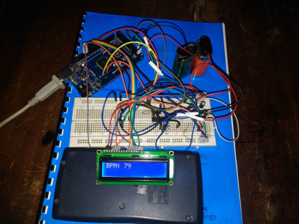
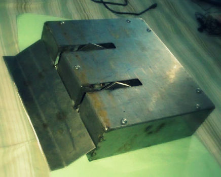

<!-- # Projects -->
Follow my Github profile [here](https://github.com/shifathossain).

---
## Embedded Wearable Device for Noninvasive Glycated Hemoglobin Estimation (2020)
<table style="width: 100%">
<colgroup>
  <col span="1" style="width: 30%;">
  <col span="1" style="width: 70%;">
</colgroup>
<thead>
  <tr>
    <td><!----></td>
    <td>Designed an embedded wearable device to measure the amount of glycated hemoglobin in blood noninvasively. <!--[<a href="https://github.com/ShifatHossain/Heartbeat-measurement-device">Project Link</a>]--></td>
    </tr> 
</thead>
</table>

---
## Mobile Camera based Fingertip DVP Signal Acquisition System (2019)
<table style="width: 100%">
<colgroup>
  <col span="1" style="width: 30%;">
  <col span="1" style="width: 70%;">
</colgroup>
<thead>
  <tr>
    <td><!----></td>
    <td>Developed an Android application to record 3-wavelength DIgital VOlume Pulse (DVP) signals directly from the mobile camera sensor. <!--[<a href="https://github.com/ShifatHossain/Heartbeat-measurement-device">Project Link</a>]--></td>
    </tr>
</thead>
</table>

---
## Automated Bottle Filling System (2016)
<table style="width: 100%">
<colgroup>
  <col span="1" style="width: 30%;">
  <col span="1" style="width: 70%;">
</colgroup>
<thead>
  <tr>
    <td></td>
    <td>Designed a conveyor system to transport and fill bottles with fluids, during undergraduate studies. The control system for this machine was designed based on Arduino and Siemens LOGO! PLC. [<a href="https://github.com/ShifatHossain/Automated-bottle-filling-machine">Project Link</a>]</td>
    </tr>
</thead>
</table>

<iframe width="560" height="315" src="https://www.youtube.com/embed/tC1EwkDHuBQ" title="YouTube video player" frameborder="0" allow="accelerometer; autoplay; clipboard-write; encrypted-media; gyroscope; picture-in-picture" allowfullscreen></iframe> 

---
## IR LED based Heart Rate Measurement device (2015)
<table style="width: 100%">
<colgroup>
  <col span="1" style="width: 30%;">
  <col span="1" style="width: 70%;">
</colgroup>
<thead>
  <tr>
    <td></td>
    <td>Designed a low-cost Arduino-based photoplethysmograph device during undergraduate studies. It was designed to measure the blood flow in the reflection form. IR light was emitted from the soft-side of the fingertip and this signal was sensed using an IR sensor, separated about 3mm from the IR light generator in the same plane. [<a href="https://github.com/ShifatHossain/Heartbeat-measurement-device">Project Link</a>]</td>
    </tr>
</thead>
</table>

---
## DESIGNING OF A CNC ROUTER FOR PCB DESIGN (2015)
<table style="width: 100%">
<colgroup>
  <col span="1" style="width: 30%;">
  <col span="1" style="width: 70%;">
</colgroup>
<thead>
  <tr>
    <td></td>
    <td>Designed a 3-axis CNC router for PCB etching during undergraduate studies. Cassis modelled with steel sheets and used 3 servo motors to control the 3 axes. The servo motors were controlled by Arduino Due (32-bit ARM SAM microcontroller). And the CNC controller was developed using MATLAB which communicated with the microcontroller using USB serial ports. [<a href="https://github.com/ShifatHossain/CNC-machine">Project Link</a>]</td>
    </tr>
</thead>
</table>

<iframe width="560" height="315" src="https://www.youtube.com/embed/bOrUhsMT6-k" title="YouTube video player" frameborder="0" allow="accelerometer; autoplay; clipboard-write; encrypted-media; gyroscope; picture-in-picture" allowfullscreen></iframe>

---
## 4-WHEELER DIFFERENTIAL DRIVE COMBAT BOT WITH ACTIVE WEDGE (2014)
<table style="width: 100%">
<colgroup>
  <col span="1" style="width: 30%;">
  <col span="1" style="width: 70%;">
</colgroup>
<thead>
  <tr>
    <td></td>
    <td>Designed a 4 wheeler combat bot having an active wedge to defeat other bots. [<a href="https://github.com/ShifatHossain/Combat-bot">Project Link</a>]</td>
    </tr>
</thead>
</table>

---
## DEVELOPMENT OF “ARMADILLO GAME ENGINE” (2012 - PRESENT)
<table style="width: 100%">
<colgroup>
  <col span="1" style="width: 30%;">
  <col span="1" style="width: 70%;">
</colgroup>
<thead>
  <tr>
    <td></td>
    <td>Developing a Game Engine named “Armadillo” in a team of 4 persons. This project is currently under development. This project is developed using C++, C# languages and OpenGL library along with other libraries.</td>
    </tr>
</thead>
</table>

---
## PARALLEL PORT SCRIPTING LANGUAGE - “MICROSCRIPT” (2011)
<table style="width: 100%">
<colgroup>
  <col span="1" style="width: 30%;">
  <col span="1" style="width: 70%;">
</colgroup>
<thead>
  <tr>
    <td></td>
    <td>Developed a scripting language to reduce hassle of C/C++ based programming and interfacing with some external devices. This scripting language had its own loop and conditional blocks. The runtime environment section is incomplete and now the project is deprecated. [<a href="https://github.com/ShifatHossain/MicroScript-scripting-language">Project Link</a>]</td>
    </tr>
</thead>
</table>

